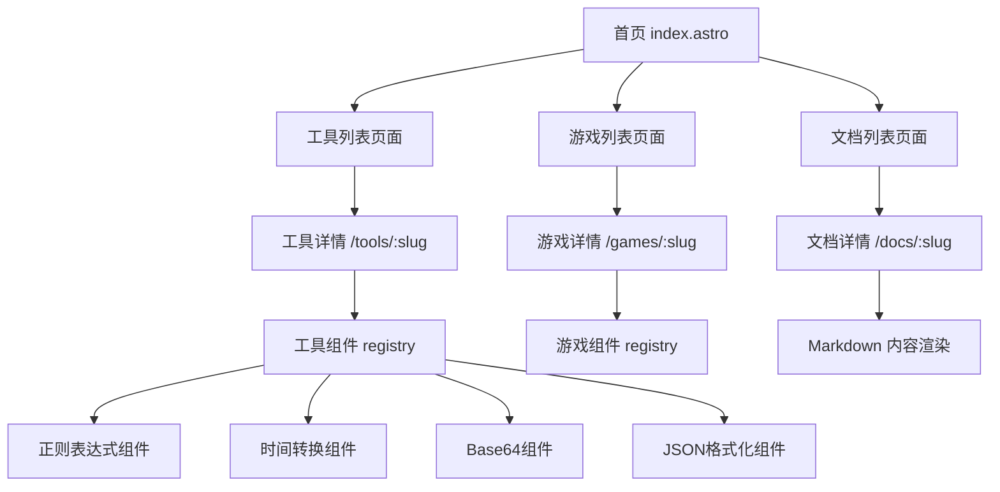

# Web Toolbox - Technical Design

Feature Name: web-toolbox
Updated: 2026-06-15

## Description

基于 Astro 框架构建的百宝箱静态网站，集成工具集合、小游戏和学习文档三大模块。采用配置驱动的架构，通过 JSON 注册表实现模块的动态发现和渲染，便于后续扩展。

## Architecture



## Components and Interfaces

### 1. Registry System

配置文件位于 `src/data/` 目录：

- `tools.json` — 工具注册表，定义工具的 slug、名称、描述、组件路径
- `games.json` — 游戏注册表，定义游戏的 slug、名称、描述、组件路径
- `nav.json` — 导航配置，定义顶部导航和侧边栏结构

### 2. Component Interface

所有工具组件遵循统一接口：

```typescript
interface ToolProps {
  title: string;
  description: string;
}

// 组件实现示例
export default function RegexTester({ title, description }: ToolProps) {
  // 工具逻辑
}
```

### 3. Layout Components

- `BaseLayout` — 全局 HTML 外壳，包含 meta、head、body 结构
- `HeaderLayout` — 顶部导航栏，响应式汉堡菜单
- `ToolLayout` — 工具页面布局，包含标题区和内容区
- `CardGrid` — 首页卡片网格组件

### 4. Content Pipeline

文档模块使用 Astro 的 Content Collections：

```
src/content/docs/
├── javascript/
│   ├── array-methods.md
│   └── async-await.md
├── css/
│   └── flexbox-guide.md
└── git/
    └── common-commands.md
```

## Data Models

### Tool Registry Entry

```json
{
  "slug": "base64",
  "name": "Base64 编码/解码",
  "description": "字符串与 Base64 格式互转",
  "category": "编码",
  "icon": "code",
  "componentPath": "../components/tools/Base64Tool.astro"
}
```

### Game Registry Entry

```json
{
  "slug": "snake",
  "name": "贪吃蛇",
  "description": "经典贪吃蛇游戏",
  "category": "休闲",
  "icon": "gamepad",
  "componentPath": "../components/games/SnakeGame.astro"
}
```

## Correctness Properties

1. 每个工具组件必须导出默认组件
2. 注册表中的 slug 必须唯一且不重复
3. 组件路径必须指向存在的文件
4. 所有工具页面支持直接通过 URL 访问

## Error Handling

1. 404 页面 — 请求不存在的工具或游戏时显示自定义 404 页面
2. 组件加载失败 — 显示错误提示和返回首页链接
3. Markdown 解析失败 — 显示原始内容或错误消息

## Test Strategy

1. 构建测试 — `astro build` 成功完成无错误
2. 路由测试 — 所有注册的 slug 对应的页面可访问
3. 组件测试 — 各工具组件输入输出正确
4. 响应式测试 — 移动设备和桌面端布局正常

## Implementation Plan

```
src/
├── data/
│   ├── tools.json           # 工具注册表
│   ├── games.json           # 游戏注册表
│   └── nav.json             # 导航配置
├── components/
│   ├── BaseHead.astro        # 全局 head
│   ├── Header.astro          # 顶部导航
│   ├── Footer.astro          # 页脚
│   ├── CardGrid.astro        # 卡片网格
│   ├── CardItem.astro        # 单个卡片
│   ├── ToolLayout.astro      # 工具页面布局
│   ├── GameLayout.astro      # 游戏页面布局
│   ├── tools/
│   │   ├── RegexTool.astro   # 正则表达式工具
│   │   ├── TimeTool.astro    # 时间戳转换
│   │   ├── Base64Tool.astro  # Base64 工具
│   │   ├── JsonTool.astro    # JSON 格式化
│   │   ├── UrlTool.astro     # URL 编解码
│   │   ├── HashTool.astro    # 哈希计算
│   │   └── ColorTool.astro   # 颜色转换器
│   └── games/
│       └── SnakeGame.astro   # 贪吃蛇（占位）
├── layouts/
│   └── BaseLayout.astro      # 全局布局
├── pages/
│   ├── index.astro           # 首页
│   ├── tools/
│   │   ├── index.astro       # 工具列表
│   │   └── [slug].astro      # 工具详情（动态路由）
│   ├── games/
│   │   ├── index.astro       # 游戏列表
│   │   └── [slug].astro      # 游戏详情（动态路由）
│   ├── docs/
│   │   ├── [...slug].astro   # 文档内容（动态路由）
│   │   └── index.astro       # 文档列表
│   └── 404.astro             # 404 页面
├── content/
│   └── docs/                 # Markdown 文档
│       ├── config.ts         # Content collection 配置
│       └── guides/           # 示例文档
├── styles/
│   └── global.css            # 全局样式
└── utils/
    └── navigation.ts         # 路由辅助函数
```

## References

[^1]: (Website) - [Astro Documentation](https://docs.astro.build)
[^2]: (Website) - [Content Collections](https://docs.astro.build/en/guides/content-collections/)
